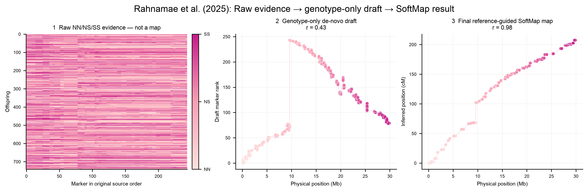

# SoftMap

[](https://github.com/kevinkorfmann/softmap-linkage/actions/workflows/ci.yml)
[](https://kevinkorfmann.github.io/softmap-linkage/)
[](https://www.python.org/downloads/)
[](LICENSE)

Turn genotype data into a linkage map, with uncertainty kept visible.



*Raw NN/NS/SS evidence, genotype-only de-novo draft, and the final
reference-guided SoftMap map for Neda Rahnamae's chromosome 3. Nothing is
randomized.*

Across six prespecified de-novo simulation blocks, SoftMap had lower mean
point-order error and was 3.3×–44.4× faster than matched GUSMap or OneMap
workflows. The [benchmark documentation](https://kevinkorfmann.github.io/softmap-linkage/benchmarks/)
reports the individual regimes, confidence and distance metrics, failed gates,
100,000-marker memory audit, and cross-platform wheel checks.

## Make a map

```bash
python -m pip install "softmap-linkage[plot] @ git+https://github.com/kevinkorfmann/softmap-linkage.git"
```

### Optional Rust acceleration

Install the small compiled extension after SoftMap:

```bash
python -m pip install "softmap-rust @ git+https://github.com/kevinkorfmann/softmap-linkage.git#subdirectory=rust"
```

SoftMap detects it automatically; no fitting calls change. Check activation with
`softmap.rust_backend_available()`, or set `SOFTMAP_DISABLE_RUST=1` to force the
NumPy reference implementation.

The extension accelerates only the two profiled pairwise-recombination kernels.
The final LOD reduction stays in NumPy, preserving bit-for-bit identical
recombination, LOD, map-coordinate, and order results.

| Measured workload | NumPy | Rust-assisted | Improvement |
| --- | ---: | ---: | ---: |
| 200,000 sparse binary pairs, Apple ARM64 | 1.67 s | 0.60 s | 2.76× |
| Complete 300-marker F2 fit, Apple ARM64 | 4.53 s | 2.83 s | 1.60× |
| Frozen 100,000-marker fit, Linux x86_64 | 74.87 s | 65.42 s | 12.6% less time |

The 100,000-marker replay retained `ok` status, all 11,606 likelihood bins, and
the exact reference order hash.

For an F2 VCF/BCF:

```python
import softmap

data = softmap.read_vcf(
    "family.vcf.gz",
    chromosome="chr1",
    parents=("PARENT_1", "PARENT_2"),
    cross_design="f2",
)
mapping = softmap.fit_f2(data, use_physical_scaffold=True)
mapping.plot("chr1-map.svg")

print(mapping.summary())
print(mapping.marker_table()[:3])
```

This keeps AA, AB, and BB (or NN, NS, and SS) as three distinct states. Physical
positions determine the reference-guided order only when
`use_physical_scaffold=True`; recombination and centimorgan coordinates still come
from the offspring genotypes.

For a backcross, doubled haploid, or phased RIL:

```python
data = softmap.read_vcf(
    "family.vcf.gz",
    chromosome="chr1",
    parents=("PARENT_1", "PARENT_2"),
    cross_design="backcross",  # or "ril" / "doubled_haploid"
)
mapping = softmap.fit(data, bootstrap=100, seed=7)
```

Use `softmap.fit_likelihood(data)` when you also need model-stability rank bands,
truth-free adverse-data routing, and regularized centimorgan coordinates. Its
summary records the selected geometry, any posterior calibration, stability
fallback, and distance weighting.

SoftMap fits one known linkage group at a time. It does not discover linkage
groups. See the [quick start](https://kevinkorfmann.github.io/softmap-linkage/quickstart/),
[Rahnamae case study](https://kevinkorfmann.github.io/softmap-linkage/case-studies/),
or [API reference](https://kevinkorfmann.github.io/softmap-linkage/api/).

## Engineering quality

- 85.29% statement coverage, enforced in CI rather than reported passively.
- 84 tests plus 3 subtests pass with the compiled backend on macOS ARM64 and
  Linux x86_64; the same suite verifies the NumPy fallback.
- Python linting and formatting, Rust formatting and Clippy, strict MkDocs, and
  clean-wheel installation are release gates.
- The Rust package is optional: the portable Python wheel has no compiler or
  platform-specific runtime requirement.

SoftMap is research software. Review genotype quality, ordering support, and the
cross model before biological interpretation.
