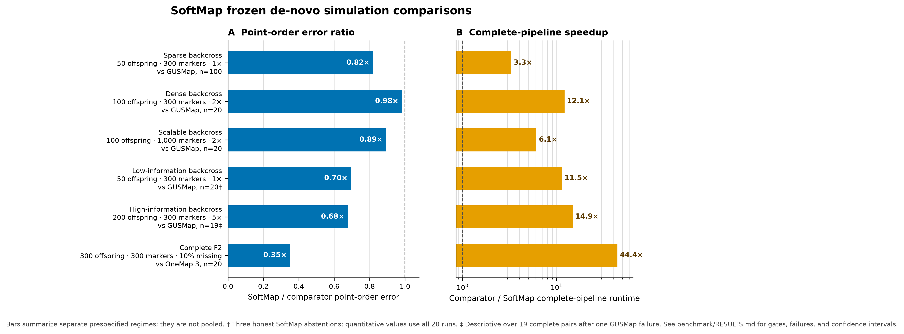

# Benchmarks

SoftMap is evaluated with separate accuracy, confidence, distance, runtime,
memory, and completion gates. It does not use a single aggregate score that can
hide a regression in one dimension behind a gain in another.

The dashed line is parity. In panel A, lower is better; in panel B, higher is
better. Each row is a separate prespecified simulation block, not a pooled
analysis.

## Matched de-novo comparisons

| Regime | Comparator | Paired runs | Point-order error, SoftMap / comparator | Error ratio | Speedup |
| --- | --- | ---: | ---: | ---: | ---: |
| Sparse backcross: 50 offspring, 300 markers, 1× | GUSMap | 100 | 0.07266 / 0.08857 | 0.82 | 3.30× |
| Dense backcross: 100 offspring, 300 markers, 2× | GUSMap | 20 | 0.02022 / 0.02058 | 0.98 | 12.14× |
| Scalable backcross: 100 offspring, 1,000 markers, 2× | GUSMap | 20 | 0.01180 / 0.01320 | 0.89 | 6.11× |
| Low-information backcross: 50 offspring, 300 markers, 1× | GUSMap | 20 | 0.07703 / 0.11082 | 0.70 | 11.46× |
| High-information backcross: 200 offspring, 300 markers, 5× | GUSMap | 19 complete pairs | 0.00490 / 0.00724 | 0.68 | 14.93× |
| Complete F2: 300 offspring, 300 markers, 10% missing | OneMap 3 | 20 | 0.002776 / 0.007904 | 0.35 | 44.39× |

The sparse, dense, scalable, and complete-F2 blocks passed their frozen gates.
The low-information block passed every quantitative gate but formally failed its
completion gate because SoftMap honestly returned `insufficient_order_information`
on three runs. The high-information row is descriptive over 19 complete pairs:
GUSMap failed one run with an infinite map, and SoftMap exceeded a separate
worst-case map-inflation gate despite winning point and adjacent-RF error on all
19 complete pairs. Those failures are retained rather than silently discarded.

[Download the exact plotted values](assets/frozen_benchmark_summary.json)

## Distance and confidence

In the dense 20-run backcross block, mean adjacent-recombination error was
0.02570 for SoftMap and 0.02683 for GUSMap. Mean coordinate RMSE was 5.96 versus
201.44 cM, and median map-length inflation was zero versus 7.09. In the F2 block,
SoftMap's model-stability bands had 0.000023 inversion error over 96.3% of
truth-bin pairs and 93.5% truth-bin coverage. Mean adjacent-RF error was 0.002662.

Confidence bands are scored as partial orders. A marker pair counts as comparable
only when its rank intervals do not overlap, so a forced total order cannot
masquerade as supported resolution.

## Uncertain-read F2 boundary

For low-certainty F2 likelihoods, SoftMap now fits a nonnegative 16-segment
composite Kosambi map to all informative marker pairs. On ten development seeds,
this reduced mean coordinate RMSE from 63.41 to 8.41 cM and adjacent-RF error
from 0.03677 to 0.02870.

The untouched 20-seed confirmation remains a formal failure: OneMap returned
only 13 maps, and one SoftMap run exceeded the frozen 0.150 maximum point-error
gate with 0.235. SoftMap completed all 20 runs and passed every mean distance and
confidence gate. Across the 13 complete pairs, reported descriptively rather
than as promotion evidence, it won all 13 in point order (0.05183 versus 0.33052)
and was 132.91× faster. This failed gate is retained because it marks the main
remaining algorithmic boundary.

## Scale and reproducibility

| Validation | Point-order error | Runtime | Peak memory | Result |
| --- | ---: | ---: | ---: | --- |
| 10,000 markers, 100 offspring, 2×; 20 seeds | 0.00470 mean | 50.98 s mean | — | All internal gates passed |
| 100,000 markers, 100 offspring, 2×; repeated release audit | 0.001031 | 73.75–75.09 s | 1.568 GiB | Identical scientific outputs and order hash |

GUSMap and SeSAM did not finish the matched 10,000-marker feasibility runs within
1,800 seconds; Lep-MAP3 exited without producing a map. This establishes SoftMap
feasibility and internal accuracy at that scale, but not an external paired
accuracy result where no comparator map was returned.

Fresh wheels were also tested outside the source tree in eight environments:
macOS ARM64 and Linux x86_64, each on Python 3.11, 3.12, 3.13, and 3.14. The binary
API, complete-F2 API, uncertain-read-F2 API, and installed command all returned
`ok`; all three orders were identical in every cell. Binary and uncertain-read
F2 map-length variation across operating systems, architectures, Python, NumPy,
and SciPy versions was 0.000000276 and 0.000000207 cM, respectively; complete-F2
map length was exactly identical.

## Empirical replay

The current release candidate rebuilds all eight Rahnamae F2 chromosomes from the
published source: 742 offspring and 2,082 complete NN/NS/SS markers. Correlation
between SoftMap and published genetic coordinates is 0.9984–1.0000, with absolute
chromosome-length error of 0.14%–13.95%. This is reference-guided empirical
validation, not a de-novo comparator claim; physical positions determine final
adjacency while offspring genotypes determine recombination and cM coordinates.

An independent de-novo confirmation used chromosomes 2--5 of the Moore et al.
Arabidopsis recombinant-inbred-line dataset, with published coordinates withheld
from fitting. SoftMap completed all four chromosomes and had 0.01664 mean
point-order error versus 0.01819 for ASMap/MSTmap. Its stability bands compared
83.38% of informative pairs with 0.00162 inversion error. The block nevertheless
formally failed because both methods averaged 0.97242 orientation-free rank
correlation, below the prespecified 0.98 gate. Genetic-length comparison was not
promoted because advanced-RIL expansion is outside SoftMap's currently calibrated
binary distance model.

## Scope boundary

The evidence supports known single linkage groups in the tested backcross,
doubled-haploid-like, phased-RIL, and complete-F2 settings. It does not yet
establish linkage-group discovery, outbred full-sib phasing, multiparental or
polyploid crosses, or universal superiority on every biological dataset. SoftMap
reports uncertainty or abstains when the data do not support a resolved order.
