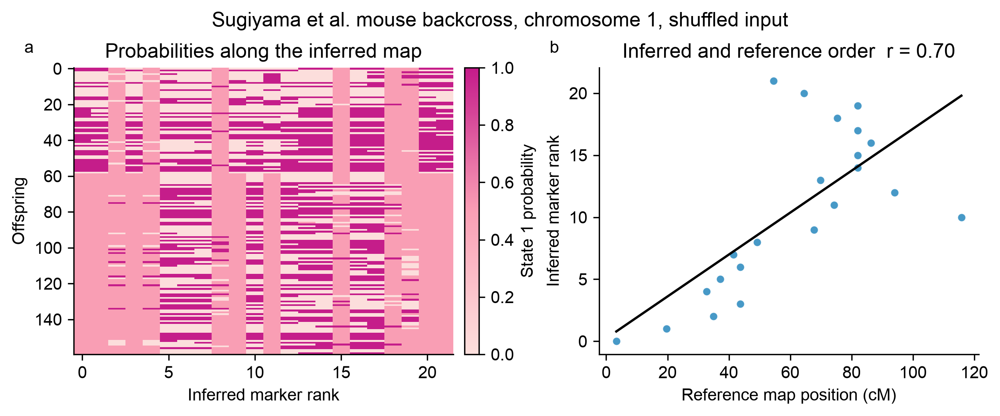

# Published-data case studies

Three public mapping datasets, three different experimental designs, and one
deliberately simple test: **after hiding the published marker order, what does
SoftMap recover—and where does it refuse to be overconfident?**

Every case starts from the study's real genotype table. Marker columns are shuffled
with a fixed seed, calls are converted to binary parental-origin probabilities, and
SoftMap is run with 100 bootstrap replicates. The published centimorgan coordinates
are used only afterward as an external order check.

## At a glance

| Study and material | Reanalysis slice | SoftMap result | What it demonstrates |
| --- | ---: | ---: | --- |
| Rahnamae et al., *Arabis* hybrids | Chr 1 · 742 offspring · 304 markers | 50 bins · 18-marker framework · r = 0.962 | Dense markers help after redundant patterns are binned |
| Moore et al., *Arabidopsis* RILs | Chr 1 · 162 lines · 26 markers | 26-marker framework · r = 0.999 | Near-complete recovery in a phase-compatible RIL design |
| Sugiyama et al., mouse backcross | Chr 1 · 250 males · 22 markers | 2-marker framework · r = 0.701 | Selective genotyping correctly produces limited support |

`r` is the absolute Pearson correlation between inferred rank and the published
centimorgan position for representative markers. Chromosome orientation is
arbitrary, so the sign is ignored. A published map is a useful benchmark, not
error-free ground truth.

## Arabidopsis gravitropism

*Plant recombinant inbred lines.* This is the clean recovery case: all 26
chromosome-1 markers enter the supported framework in almost exactly the published
order.


| Lines | Markers | Framework markers | Order correlation |
| ---: | ---: | ---: | ---: |
| 162 | 26 | 26 | 0.999 |

### Input

The input is replicate 2 from Moore et al. (2013), an Arabidopsis Bay × Sha
recombinant-inbred population used to study root gravitropism. Homozygous L and C
calls become 0.01 and 0.99; missing calls remain 0.5.

### Interpretation

The probability matrix becomes a continuous block pattern after ordering, and every
representative marker passes 80% pairwise bootstrap support. This is the expected
behavior when the cross matches the model and the chromosome contains enough
informative recombinations.

Sources: [original study](https://doi.org/10.1534/genetics.113.152678) and
[R/qtl2 source data](https://rqtl.org/qtl2/pages/sampledata.html).

## Arabis floodplain hybrids

*Plant contemporary hybridization.* This is a dense, phase-limited example: all
304 source markers reduce to 50 informative segregation patterns and a supported
18-marker framework.


| Offspring | Markers | Bins | Framework markers | Order correlation |
| ---: | ---: | ---: | ---: | ---: |
| 742 | 304 | 50 | 18 | 0.962 |

### Input

The input contains all 304 chromosome-1 markers from Rahnamae et al. (2025). NN and
SS calls become 0.01 and 0.99. Heterozygous NS and missing calls become 0.5 because
their phase is unresolved in SoftMap's binary representation.

### Interpretation

This is a conversion stress test, not a replacement F2 map. Automatic binning
groups patterns with at most 2% expected disagreement before ordering: 304 markers
become 50 bins, 18 of which enter the 80%-supported framework. The chromosome-scale
agreement shows the value of the full marker set without treating unphased
heterozygotes as binary parental-origin information.

Source: [study repository and data](https://github.com/nedarahnama/Contemporary_hybridization).

## Salt-induced hypertension in mice

*Mammal backcross.* This is the cautionary case: the point order follows the
published map broadly, but bootstrap evidence supports only two framework markers.



| Offspring | Markers | Framework markers | Order correlation |
| ---: | ---: | ---: | ---: |
| 250 | 22 | 2 | 0.701 |

### Input

The input is chromosome 1 from the Sugiyama et al. (2001) mouse backcross. Calls 0
and 1 become 0.01 and 0.99; missing calls become 0.5. The original experiment typed
many markers only in animals with extreme blood-pressure phenotypes.

### Interpretation

Selective genotyping leaves different markers informed by different subsets of
offspring. SoftMap can propose a point order, but the resampled data do not justify
a long fixed framework. Reporting two supported markers is more useful than
presenting all 22 as equally certain.

Sources: [original study](https://doi.org/10.1006/geno.2000.6411) and
[R/qtl dataset documentation](https://github.com/kbroman/qtl/blob/main/man/hyper.Rd).

## Reproduce the analyses

The loaders read the public source tables directly; no processed genotype files are
stored in this repository.

```python
import softmap

data = softmap.grav2_ril(chromosome=1).shuffled(seed=12)
mapping = softmap.fit(
    data,
    bootstrap=100,
    confidence=0.8,
    seed=8,
    bin_threshold=0.005,
)
mapping.plot("case.png")
```

Run all three cases with:

```bash
python examples/published_case_studies.py
```

These examples are method checks, not biological reinterpretations of the original
phenotypes or QTLs. SoftMap estimates marker order and ordering confidence; it does
not estimate centimorgan distances in these examples.
