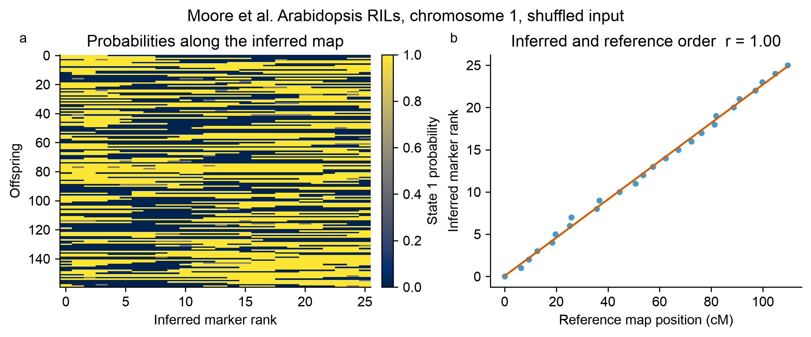
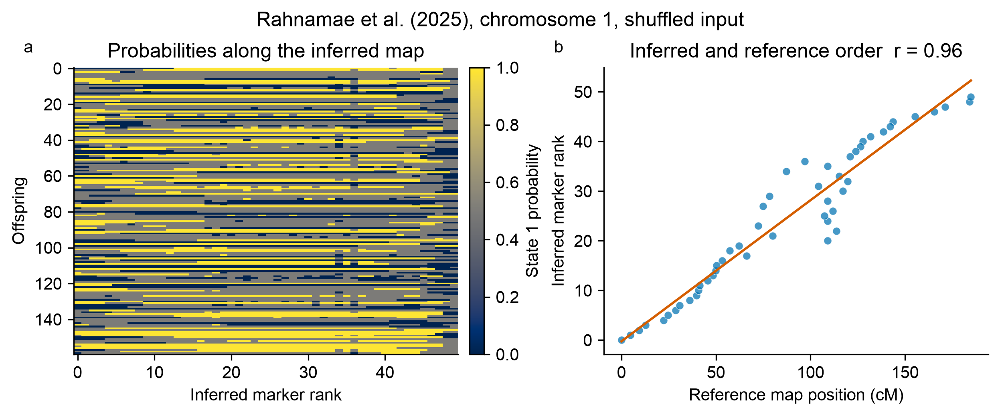

# Published-data case studies

Three public mapping datasets, three different experimental designs, and one
deliberately simple test: **after hiding the published marker order, what does
SoftMap recover—and where does it refuse to be overconfident?**

Every case starts from the study's real genotype table. Marker columns are shuffled
with a fixed seed, calls are converted to binary parental-origin probabilities, and
SoftMap is run with 100 bootstrap replicates. The published centimorgan coordinates
are used only afterward as an external order check.

<div class="case-summary" markdown>
  <div><span>3</span> published datasets</div>
  <div><span>3</span> cross contexts</div>
  <div><span>100</span> bootstraps per case</div>
</div>

## At a glance

| Study and material | Reanalysis slice | SoftMap result | What it demonstrates |
| --- | ---: | ---: | --- |
| Rahnamae et al., *Arabis* hybrids | Chr 1 · 742 offspring · 304 markers | 50 bins · 18-marker framework · r = 0.962 | Dense markers help after redundant patterns are binned |
| Moore et al., *Arabidopsis* RILs | Chr 1 · 162 lines · 26 markers | 26-marker framework · r = 0.999 | Near-complete recovery in a phase-compatible RIL design |
| Sugiyama et al., mouse backcross | Chr 1 · 250 males · 22 markers | 2-marker framework · r = 0.701 | Selective genotyping correctly produces limited support |

`r` is the absolute Pearson correlation between inferred rank and the published
centimorgan position for representative markers. Chromosome orientation is
arbitrary, so the sign is ignored. A published map is a useful benchmark, not
error-free ground truth.

<div class="case-gallery">
  <article class="case-card case-card--strong">
    <div class="case-card__eyebrow">Plant · recombinant inbred lines</div>
    <h2>Arabidopsis gravitropism</h2>
    <p class="case-card__lead">The clean recovery case: all 26 chromosome-1 markers enter the supported framework, in almost exactly the published order.</p>
    
    <dl class="case-metrics">
      <div><dt>Lines</dt><dd>162</dd></div>
      <div><dt>Markers</dt><dd>26</dd></div>
      <div><dt>Framework</dt><dd>26</dd></div>
      <div><dt>Order r</dt><dd>0.999</dd></div>
    </dl>
    <h3>What went in</h3>
    <p>Replicate 2 from Moore et al. (2013), an Arabidopsis Bay × Sha recombinant-inbred population used to study root gravitropism. Homozygous L and C calls become 0.01 and 0.99; missing calls remain 0.5.</p>
    <h3>What SoftMap adds</h3>
    <p>The probability matrix becomes a continuous block pattern after ordering, and every representative marker passes 80% pairwise bootstrap support. This is the behavior expected when the cross matches the model and the chromosome contains enough informative recombinations.</p>
    <p class="case-card__source"><a href="https://doi.org/10.1534/genetics.113.152678">Study</a> · <a href="https://rqtl.org/qtl2/pages/sampledata.html">R/qtl2 source data</a></p>
  </article>

  <article class="case-card">
    <div class="case-card__eyebrow">Plant · contemporary hybridization</div>
    <h2>Arabis floodplain hybrids</h2>
    <p class="case-card__lead">A dense, phase-limited example: all 304 source markers reduce to 50 informative segregation patterns and a supported 18-marker framework.</p>
    
    <dl class="case-metrics">
      <div><dt>Offspring</dt><dd>742</dd></div>
      <div><dt>Markers</dt><dd>304</dd></div>
      <div><dt>Bins / framework</dt><dd>50 / 18</dd></div>
      <div><dt>Order r</dt><dd>0.962</dd></div>
    </dl>
    <h3>What went in</h3>
    <p>All 304 chromosome-1 markers from Rahnamae et al. (2025). NN and SS calls become 0.01 and 0.99. Heterozygous NS and missing calls become 0.5 because their phase is unresolved in SoftMap's binary representation.</p>
    <h3>How to read the result</h3>
    <p>This is a conversion stress test, not a replacement F2 map. Automatic binning groups patterns with at most 2% expected disagreement before ordering: 304 markers become 50 bins, 18 of which enter the 80%-supported framework. The stronger chromosome-scale agreement shows the value of the full marker set without pretending that unphased heterozygotes contain binary parental-origin information.</p>
    <p class="case-card__source"><a href="https://github.com/nedarahnama/Contemporary_hybridization">Study repository and source data</a></p>
  </article>

  <article class="case-card case-card--caution">
    <div class="case-card__eyebrow">Mammal · backcross</div>
    <h2>Salt-induced hypertension in mice</h2>
    <p class="case-card__lead">The cautionary case: the point order follows the published map broadly, but bootstrap evidence supports only two framework markers.</p>
    
    <dl class="case-metrics">
      <div><dt>Offspring</dt><dd>250</dd></div>
      <div><dt>Markers</dt><dd>22</dd></div>
      <div><dt>Framework</dt><dd>2</dd></div>
      <div><dt>Order r</dt><dd>0.701</dd></div>
    </dl>
    <h3>What went in</h3>
    <p>Chromosome 1 from the Sugiyama et al. (2001) mouse backcross. Calls 0 and 1 become 0.01 and 0.99; missing calls become 0.5. The original experiment typed many markers only in animals with extreme blood-pressure phenotypes.</p>
    <h3>Why limited support is the result</h3>
    <p>Selective genotyping leaves different markers informed by different subsets of offspring. SoftMap can propose a point order, but the resampled data do not justify a long fixed framework. Reporting two supported markers is more useful than presenting all 22 as equally certain.</p>
    <p class="case-card__source"><a href="https://doi.org/10.1006/geno.2000.6411">Study</a> · <a href="https://github.com/kbroman/qtl/blob/main/man/hyper.Rd">R/qtl dataset documentation</a></p>
  </article>
</div>

## Reproduce the gallery

The loaders read the public source tables directly; no processed genotype files are
stored in this repository.

```python
import softmap

data = softmap.grav2_ril(chromosome=1).shuffled(seed=12)
mapping = softmap.fit(
    data,
    bootstrap=100,
    confidence=0.8,
    seed=8,
    bin_threshold=0.005,
)
mapping.plot("case.png")
```

Run all three cases with:

```bash
python examples/published_case_studies.py
```

The gallery is a method check, not a biological re-interpretation of the original
phenotypes or QTLs. SoftMap estimates marker order and ordering confidence; it does
not estimate centimorgan distances in these examples.
