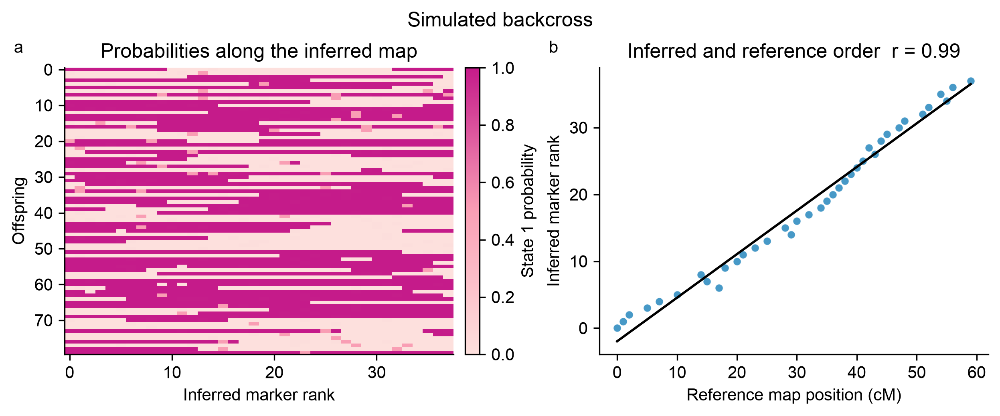

# SoftMap

SoftMap is for researchers who already know which markers belong to one linkage
group and need to determine their order from uncertain genotype data. It converts
phased, two-state data from doubled-haploid, backcross, or recombinant inbred line
(RIL) populations into a complete marker order, co-segregation bins, and a
confidence-supported framework with placement uncertainty. It does not discover
linkage groups, infer phase for general F2 or full-sib crosses, or estimate
centimorgan distances.

## Install

```bash
python -m pip install "softmap-linkage[plot] @ git+https://github.com/kevinkorfmann/softmap-linkage.git"
```

## Start with your data

| Your input | What SoftMap expects |
| --- | --- |
| VCF, bgzipped VCF, or BCF | Passing biallelic SNPs from one chromosome/contig, with offspring genotypes and preferably two parental samples. |
| NumPy array | A finite offspring-by-marker matrix of parental-state-1 probabilities in `[0, 1]`. |

=== "VCF/BCF with parents"

    This is the recommended route when parental samples are available. The names
    in `parents=(...)` are exact sample IDs from your VCF header. For a backcross,
    put the recurrent parent first.

    ```python
    import softmap

    data = softmap.read_vcf(
        "family.vcf.gz",
        chromosome="chr1",
        parents=("BC_PARENT", "DONOR_PARENT"),
        cross_design="backcross",
    )

    mapping = softmap.fit(
        data,
        bootstrap=100,
        confidence=0.8,
        seed=7,
    )
    ```

    Replace `BC_PARENT` and `DONOR_PARENT` with your own sample IDs. The recurrent
    parent is the parent to which offspring were crossed back; the donor is the
    other parent that contributed the alternative allele or trait. SoftMap removes
    both parental samples from the offspring rows automatically.

    Use `cross_design="ril"` for recombinant inbred lines or
    `"doubled_haploid"` for doubled-haploid populations.

=== "Already oriented VCF/BCF"

    If REF/ALT coding already has the same binary parental-state orientation at
    every marker and the file contains one contig, use the short form:

    ```python
    import softmap

    mapping = softmap.fit(
        "offspring.vcf.gz",
        bootstrap=100,
        confidence=0.8,
    )
    ```

    Call `read_vcf()` explicitly when you need to select a chromosome or offspring
    samples. Supplying parents is safer when REF/ALT orientation varies relative to
    parental origin.

=== "Probability matrix"

    Rows are offspring, columns are markers, and each value is the probability of
    parental state 1. A value of 0.5 means that the binary state is unknown.

    ```python
    import numpy as np
    import softmap

    probabilities = np.array([
        [0.01, 0.04, 0.95],
        [0.99, 0.92, 0.08],
        [0.50, 0.87, 0.12],
    ])

    mapping = softmap.fit(
        probabilities,
        marker_names=["m1", "m2", "m3"],
        bootstrap=100,
        confidence=0.8,
    )
    ```

SoftMap fits **one known linkage group per call**. It does not split a genome-wide
VCF into linkage groups. Use `chromosome="..."` or prepare each linkage group
separately.

## What comes back?

`softmap.fit()` returns a `Map` object. It keeps both convenient, serializable
outputs and the complete low-level result:

```python
print(mapping.summary())
print(mapping.ordered_markers[:10])
print(mapping.framework_markers[:10])
print(mapping.marker_table()[:3])

mapping.plot("map.png")
mapping.plot_marker_order("marker_order.png")
```

| Output | Meaning |
| --- | --- |
| `mapping.summary()` | Run status, offspring count, marker count, bin count, framework size, and confidence threshold. |
| `mapping.ordered_markers` | Every input marker in the inferred complete order. |
| `mapping.framework_markers` | The more defensible backbone whose pairwise order reaches the requested support. |
| `mapping.marker_table()` | One row per input marker with its bin, order rank, framework rank, and placement bounds. |
| `mapping.plot(path)` | Probability blocks along the inferred map, returned as a Matplotlib figure and optionally saved. |
| `mapping.plot_marker_order(path)` | Input marker order compared with inferred order. |
| `mapping.data` | The normalized `LinkageData` used for fitting. |
| `mapping.result` | Low-level bin, bootstrap, precedence, framework, and interval arrays. |

The summary `status` is `ok` when at least three framework markers are supported;
otherwise it is `limited_support`. Limited support is a scientific diagnostic, not
a software error.

Each marker-table row contains zero-based ranks:

| Field | Meaning |
| --- | --- |
| `marker` | Input VCF ID, `CHROM:POS` fallback, or supplied array marker name. |
| `bin` | Co-segregation-bin identifier; markers in one bin are not distinguishable at the selected threshold. |
| `order_rank` | Rank of that bin in the complete inferred bin order. |
| `is_representative` | Whether the marker represented its bin during fitting. |
| `framework_rank` | Supported framework rank, or `None`. |
| `interval_left`, `interval_right` | Placement relative to framework anchors, not base pairs or centimorgans. `-1` and the framework size represent positions beyond the end anchors. |

Map orientation is arbitrary: a complete reversal represents the same linkage map.
SoftMap estimates marker order and support, not centimorgan distances.

## How VCF fields are interpreted

`read_vcf()` converts two genotype states into a state-1 probability:

| VCF information | Output probability |
| --- | --- |
| Usable `PL` | Normalized probability from the two relevant phred-scaled genotype likelihoods. |
| Usable `GL` without `PL` | Normalized probability from the two relevant log10 genotype likelihoods. |
| Compatible `GT` only | `0.01` for state 0 or `0.99` for state 1. |
| No usable likelihood and missing/incompatible `GT` | `0.5`, meaning unknown binary state. |

The loader retains passing biallelic SNPs with two usable inheritance states. It
skips indels, multiallelic variants, failed filters, monomorphic variants, and
parent-uninformative markers. It returns offspring-by-marker probabilities, marker
names, physical VCF positions, and the chromosome label in `LinkageData`.

See the [complete API reference](api.md) for every input argument, filtering rule,
output field, exception, and an end-to-end export example.

## Important fitting settings

| Setting | Practical meaning |
| --- | --- |
| `bootstrap=20` | Fast diagnostic default. |
| `bootstrap=100` or more | Recommended starting point for a final analysis. |
| `confidence=0.8` | Requires 80% pairwise precedence support for framework anchors. |
| `bin_threshold=0.01` | Merges markers with at most about 1% expected disagreement; use `None` for automatic selection. |
| `seed=7` | Makes bootstrap results reproducible. |

For a robust complete order with model-sensitivity rank bands instead of a
confidence-selected framework, see `softmap.fit_likelihood()` in the
[API reference](api.md#likelihood-mds-ensemble-fitting).

## Run the included example

```python
import softmap

data = softmap.demo()
mapping = softmap.fit(data)
mapping.plot("map.png")
```



The [step-by-step guide](guide.md) explains the figure, validation, diagnostic and
final settings, and result interpretation. The [quick start](quickstart.md) is the
shortest runnable path, and the [case studies](case-studies.md) show plant RIL,
plant hybrid, and mouse backcross examples.

## Is SoftMap appropriate for my cross?

SoftMap is best suited to doubled-haploid, backcross, or phased RIL data with
probabilistic genotype calls and many informative offspring. More offspring provide
more observable crossovers; adding co-segregating markers does not add equivalent
ordering information.

General unphased F2 and full-sib phase inference is outside the current model. See
[which data work best](data.md#which-data-work-best) before biological
interpretation. The [algorithm guide](algorithm.md) explains the probability model,
ordering, bootstrap support, framework selection, and placement intervals.

The package is research software. Inspect support summaries and validate the model
assumptions for your cross before drawing biological conclusions.
