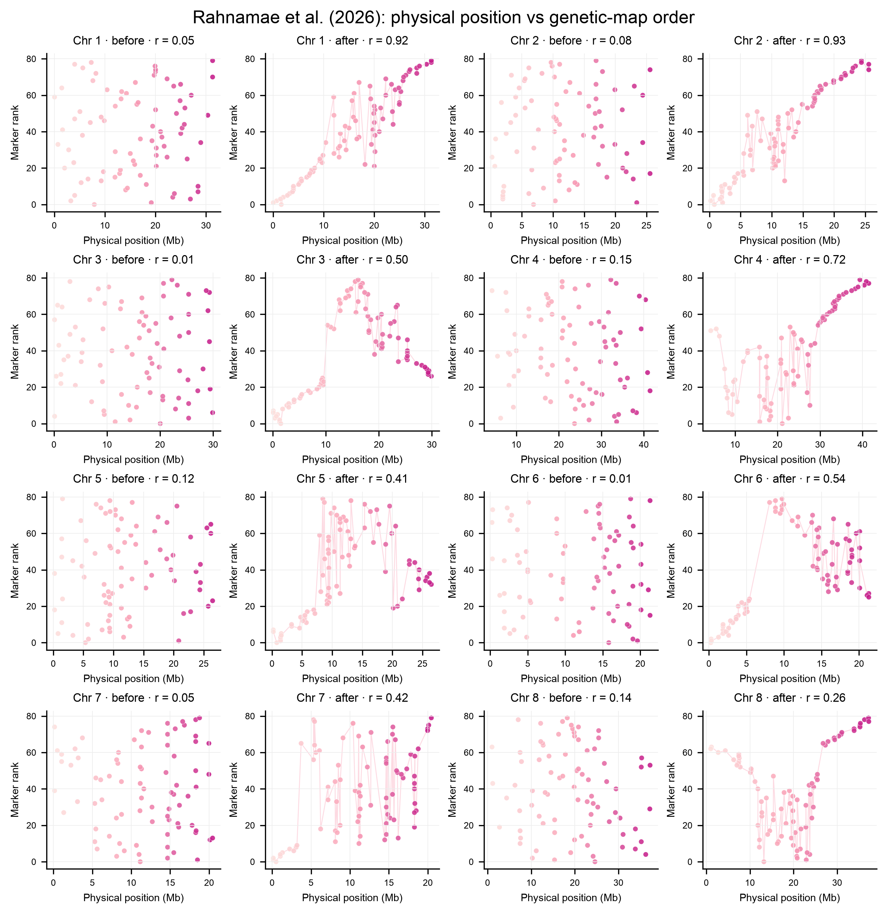
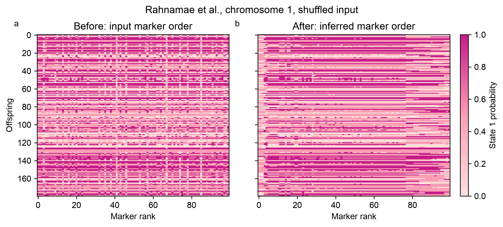

# SoftMap

SoftMap creates confidence-aware linkage maps from probabilistic inheritance states.
It is designed for cases where read depth, imputation, or genotype uncertainty make
hard calls misleading.

The small public interface has three main steps:

```python
import softmap

data = softmap.demo()
mapping = softmap.fit(data)
mapping.plot("map.png")
```

SoftMap reports marker bins, an inferred order, bootstrap rank uncertainty, and a
framework of markers whose pairwise order reaches the requested support.

SoftMap is best suited to doubled-haploid, backcross, or phased RIL data with
probabilistic genotype calls and many informative offspring. More offspring provide
more observable crossovers; simply adding many co-segregating markers does not add
the same ordering information. See [which data work best](data.md#which-data-work-best).



The top figure compares physical position with shuffled input rank and inferred
genetic-map rank for all eight chromosomes in a 4×4 layout. SoftMap estimates order
rather than centimorgan distances, so the vertical axes are marker ranks.



The marker-matrix figure shows a reproducibly shuffled chromosome 1 from the
Rahnamae et al. (2026) dataset before and after marker ordering. Both panels contain the same
probabilities; only the marker columns change. See the
[plotting guide](plotting.md) for the conversion and interpretation.

## Scope

SoftMap currently accepts one linkage group represented as phased binary
parental-origin probabilities. It is appropriate for doubled-haploid, backcross,
or phased RIL-like data. General F2 and full-sib phase inference is outside the
current model.

The package is research software. A supported framework can be sparse when the data
do not contain enough ordering information; that is an informative result.
