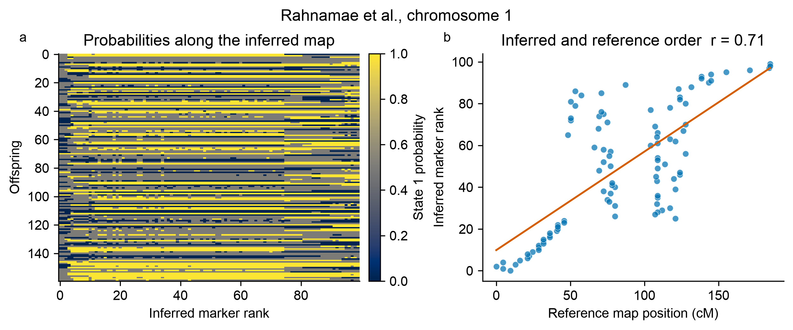

# SoftMap

SoftMap creates confidence-aware linkage maps from probabilistic inheritance states.
It is designed for cases where read depth, imputation, or genotype uncertainty make
hard calls misleading.

The small public interface has three main steps:

```python
import softmap

data = softmap.demo()
mapping = softmap.fit(data)
mapping.plot("map.png")
```

SoftMap reports marker bins, an inferred order, bootstrap rank uncertainty, and a
framework of markers whose pairwise order reaches the requested support.



The figure uses chromosome 1 from the Rahnamae et al. dataset. See the
[plotting guide](plotting.md) for the conversion and interpretation.

## Scope

SoftMap currently accepts one linkage group represented as phased binary
parental-origin probabilities. It is appropriate for doubled-haploid, backcross,
or phased RIL-like data. General F2 and full-sib phase inference is outside the
current model.

The package is research software. A supported framework can be sparse when the data
do not contain enough ordering information; that is an informative result.
