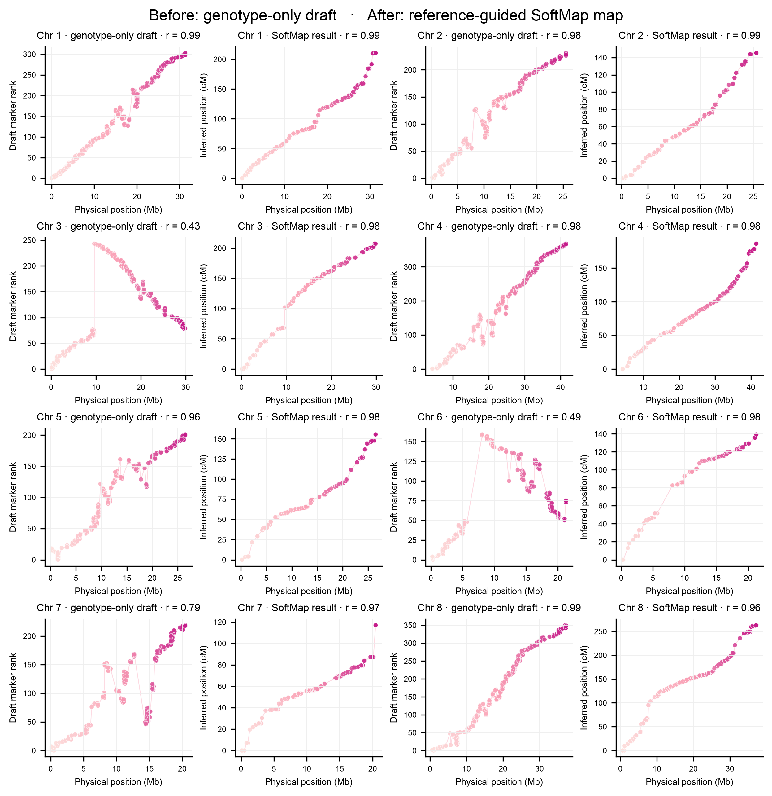

# Plotting

Every fitted map has a `plot()` method:

```python
mapping.plot("map.svg")
```

For F2 data, the left panel shows complete AA/AB/BB genotype dosage along the map.
The right panel shows SoftMap cM against physical position when available.

## Raw evidence to final map

```python
data = softmap.contemporary_hybridization_f2(chromosome=3)
mapping = softmap.fit_f2(data, use_physical_scaffold=True)
softmap.plot_f2_three_stage(mapping, "three-stage.svg")
```


The raw panel uses the observed offspring and original marker order exactly as
loaded. It is evidence, not an ordering result. The draft is the rawest meaningful
map, and the final panel adds the explicitly reported physical scaffold.

## Rahnamae's eight chromosomes

```python
import softmap

maps = [
    softmap.fit_f2(
        softmap.contemporary_hybridization_f2(chromosome=chromosome),
        use_physical_scaffold=True,
    )
    for chromosome in range(1, 9)
]

softmap.plot_physical_output_grid(
    maps,
    maps,
    "physical_softmap_outputs_grid.svg",
    use_de_novo_rank=True,
)
```



The left plot is an honest noisy “before”: SoftMap's genotype-only de-novo draft,
computed from all NN/NS/SS calls without randomizing the markers. The right plot
is the final reference-guided SoftMap output: Kosambi genetic position estimated
from the same offspring calls after applying the physical scaffold.

Why are Rahnamae's published maps so clean? Their mapping pipeline also used the
complete F2 genotypes, extensive marker filtering and correction, the Kosambi map
function, physical orientation, and manual review of several regions. A clean
reference-guided map is therefore the result of both genotype evidence and
curation—not an appropriate baseline to compare with an artificial random order.

## Published physical–genetic map

To plot the published coordinates themselves:

```python
positions = softmap.contemporary_map_positions()
softmap.plot_physical_vs_genetic(positions, "published-map.svg")
```


Source: [Rahnamae et al. Contemporary_hybridization](https://github.com/nedarahnama/Contemporary_hybridization) ·
[doi:10.1111/nph.70779](https://doi.org/10.1111/nph.70779)
