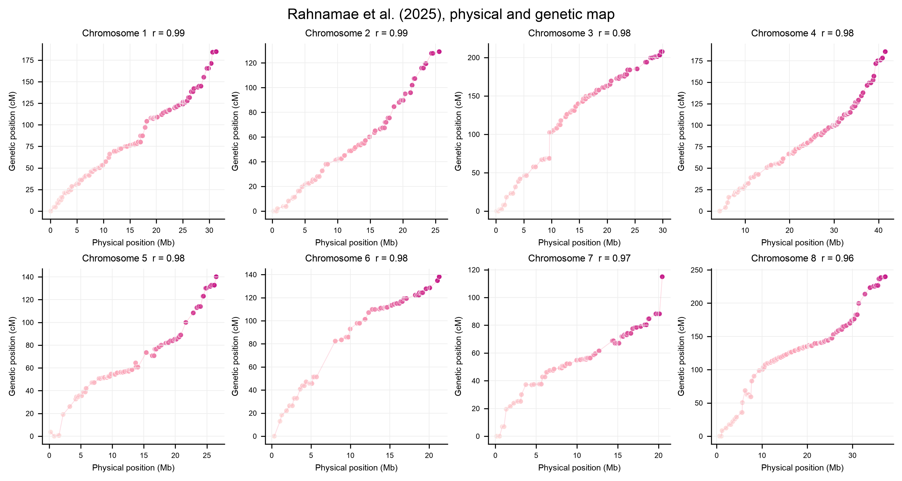

# Plotting

Every fitted map has a `plot` method:

```python
mapping.plot("map.png")
mapping.plot("map.svg")
```

The probability panel uses the same light-pink → pink → magenta state scale as the
before/after marker-order plots: state 0 is light, uncertain values near 0.5 are
pink, and state 1 is dark magenta. Override the three anchors when needed:

```python
mapping.plot("map.png", colors=("#fde0dd", "#fa9fb5", "#c51b8a"))
```

The first panel displays state probabilities along the inferred map. The second
panel compares inferred order with reference positions when available; otherwise it
shows 95% bootstrap rank intervals. The palette is color-vision friendly, and SVG
is recommended for scalable line and text output.

## Contemporary hybridization example

The published example is loaded directly from the source repository:

```python
import softmap

data = softmap.contemporary_hybridization(chromosome=1, markers=100)
data = data.shuffled(seed=11)
mapping = softmap.fit(
    data,
    bootstrap=20,
    confidence=0.8,
    seed=7,
    bin_threshold=0.005,
)
mapping.plot("contemporary_hybridization.svg")
```

The source cross is F2-like and includes NN, NS, and SS calls. For this binary
software demonstration, NN becomes 0.01, SS becomes 0.99, and NS or missing calls
become 0.5. The reference positions are the published centimorgan coordinates.
This conversion tests loading, fitting, uncertainty summaries, and plotting, but it
does not perform full F2 phase inference and should not be treated as a revised
biological map.

Source data: [Rahnamae et al., Contemporary_hybridization](https://github.com/nedarahnama/Contemporary_hybridization)

Article: Rahnamae et al. (2026), New Phytologist 249: 1542–1557,
[doi:10.1111/nph.70779](https://doi.org/10.1111/nph.70779). The article was first
published online in December 2025; its final citation year is 2026.

## Physical and genetic map

The source table also contains physical positions in marker names and published
genetic positions in centimorgans. Load and plot all eight chromosomes with:

```python
positions = softmap.contemporary_map_positions()
softmap.plot_physical_vs_genetic(
    positions,
    "physical_vs_genetic_map.png",
)
```

The light-to-dark marker gradient follows physical position and uses `#fde0dd`,
`#fa9fb5`, and `#c51b8a`.



## Marker order before and after

Use the same fitted map to compare the original marker columns with the inferred
order:

```python
mapping.plot_marker_order("marker_order_before_after.png")
```

The flagship example first shuffles the published marker columns with a fixed seed.
Both panels contain the same probabilities and offspring. Only the marker columns
change, making the ordering step visible without changing the underlying data.


## Physical position before and after

Fit one map per chromosome, then place each before/after pair in a 4×4 figure:

```python
chromosome_maps = [
    softmap.fit(
        softmap.contemporary_hybridization(
            chromosome=chromosome,
            markers=80,
        ).shuffled(seed=10 + chromosome),
        bootstrap=10,
        confidence=0.8,
        seed=20 + chromosome,
        bin_threshold=0.005,
    )
    for chromosome in range(1, 9)
]

softmap.plot_physical_order_grid(
    chromosome_maps,
    "physical_order_before_after_grid.png",
)
```

Physical position is compared with shuffled input rank and inferred map rank.
Chromosome orientation is arbitrary and is aligned to physical position for display.
The vertical axes are labeled as ranks because SoftMap does not estimate centimorgan
distances.


